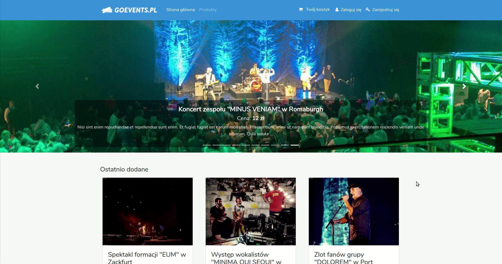

GoEvents.pl (laravel-shop)
==================================================
Prosty sklep internetowy napisany przy użyciu frameworka Laravel oraz biblioteki jQuery. Umożliwia przegląd i zakup biletów na wydarzenia kulturalne. 

### Demo
<a href="https://vimeo.com/450545553" target="_blank"></a>



## Funkcje
- Rejestracja i logowanie
- Przegląd produktów, paginacja, stany magazynowe
- Panel administratora Voyager
- Walidacja danych
- Interaktywny koszyk i galeria zdjęć (jQuery)
- Powiadomienia e-mail + przeglądarka powiadomień
- Generowanie numerów zamówienia
- Generator przykładowych produktów

## Instrukcja

1. Ściągnij repozytorium
``` git clone git@github.com:kabi097/laravel-shop.git ```
2. Zainstaluj PHP z dodatkami
```
sudo apt-get install php7.4 php7.4-xml php7.4-gd php7.4-mbstring php7.4-mysql
```
3. Zainstaluj bazę danych MySQL
```
sudo apt-get update
sudo apt-get install mysql-server
mysql_secure_installation
```
4. Zaloguj się do MySQL, dodaj bazę danych i przykładowego użytkownika 
```
mysql -u root -p 
[wpisz hasło]
CREATE DATABASE laravelshop;
grant all privileges on laravelshop.* to user1@'%' identified by 'qwerty123';
grant all privileges on laravelshop.* to user1@localhost identified by 'qwerty123';
```
5. Skopiuj zawartość *.env.example* do pliku *.env* i uzupełnij dane
```
DB_DATABASE=laravelshop
DB_USERNAME=user1
DB_PASSWORD=qwerty123
```
6. Zainstaluj zależności
```
composer install
```
7. Wygeneruj klucz ```php artisan key:generate```

8. Wykonaj migrację
```
php artisan migrate:fresh
```
9. Zainstaluj panel administratora Voyager
```
php artisan voyager:install
```
10. Dodaj nowego użytkownika do panelu Voyager
```
php artisan voyager:admin admin@admin.pl --create
```
11. (opcjonalne) Wypełnij bazę danych przykładowymi danymi
```
php artisan db:seed
```
12. (opcjonalne) Pobierz przykładowe obrazki dla wszystkich produktów w bazie
```
php artisan db:seed --class ProductImagesSeeder
```
13. Uruchom serwer aplikacji ``` php artisan serve ```
14. Wejdź pod adres [localhost:8000](http://localhost:8000) i korzystaj z aplikacji.
